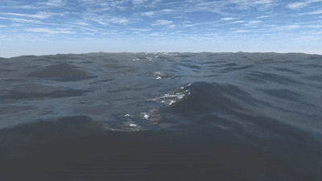

# Real-Time Ocean Simulation in Unity

## Project Overview

This project, developed as CS426 ( Game Development Course ) Term Project for Spring 2024, explores and implements techniques for realistic real-time ocean surface simulation within the Unity engine. The goal is to render a visually convincing and performant ocean by leveraging procedural mesh generation, shader-based wave functions, and dynamic tessellation.

The simulation draws inspiration from established methods in computer graphics, including concepts from Nvidia's GPU Gems, Tessendorf's FFT-based ocean water, and procedural noise techniques for wave generation.

## How to Use / Setup
1.  Clone this repository.
2.  Open the project in Unity (specify version, e.g., Unity 202X.X.Xf1).
3.  Open the main scene (e.g., `OceanScene.unity`).
4.  Press Play to view the simulation.

## Acknowledgements / References

This work builds upon concepts and techniques discussed by:
* Nvidia GPU Gems (Effective Water Simulation)
* Jerry Tessendorf (Simulating Ocean Water)
* Catlike Coding (Procedural Meshes in Unity)
* Sebastian Lague (Procedural Landmass/Noise Generation)
* Acerola (Water Simulation Techniques in Games)

---
